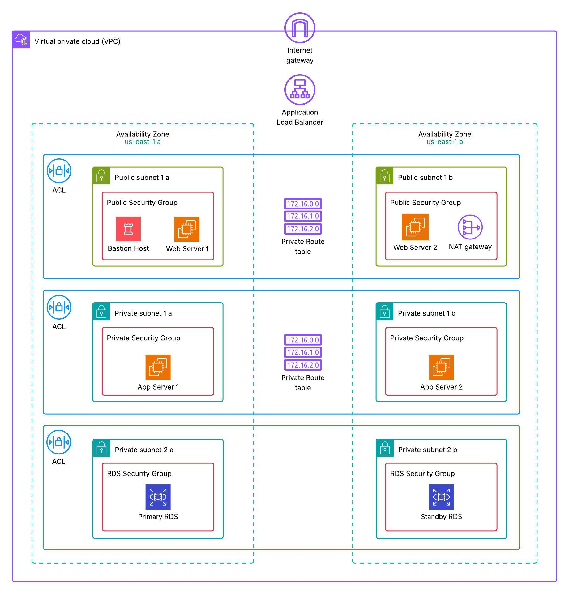
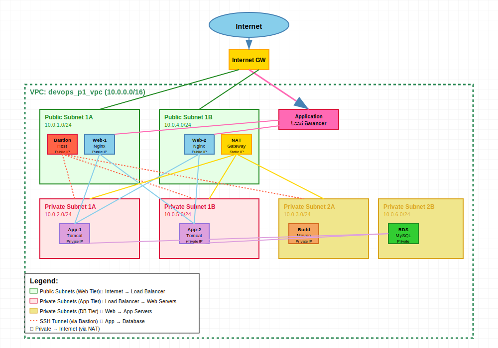

# DevOps Project 01 - 3-Tier Java Web Application Deployment

## Project Overview

This project demonstrates the complete deployment of a Java Spring Boot web application using a **3-tier architecture** on AWS with full automation through Infrastructure as Code (IaC) and Configuration Management.

## Architecture Diagrams

### AWS Infrastructure Diagram


### Communication Flow Diagram


### Architecture Components
- **Presentation Tier**: Nginx reverse proxy/load balancers on public subnets
- **Application Tier**: Apache Tomcat servers hosting Java application on private subnets  
- **Data Tier**: MySQL RDS database in isolated database subnets

### Technology Stack
- **Infrastructure**: AWS (VPC, EC2, RDS, S3, Application Load Balancer)
- **IaC**: AWS CloudFormation for infrastructure provisioning
- **Configuration Management**: Ansible for automated deployment and configuration
- **Application**: Java Spring Boot web application with login/registration functionality
- **Build Tool**: Apache Maven
- **Web Server**: Nginx (reverse proxy and load balancer)
- **Application Server**: Apache Tomcat 9
- **Database**: MySQL (Amazon RDS)

## Project Structure

```
DevOps-Project-01/
├── README.md                                    # This documentation file
├── aws_architecture_communication_diagram.svg  # System communication flow diagram
├── aws_infra_diagram.jpeg                      # AWS infrastructure architecture diagram
├── setup.sh                                    # Initial environment setup script
├── cloudFormation/
│   └── infra.yml                      # Complete AWS infrastructure template
├── devops-ansible/
│   ├── ansible.cfg                    # Ansible configuration
│   ├── group_vars/                    # Variable files for different server groups
│   │   ├── all.yml                   # Common variables
│   │   ├── appservers.yml            # Tomcat server variables
│   │   ├── bastion.yml               # Bastion host variables
│   │   └── webservers.yml            # Nginx server variables
│   ├── inventory/
│   │   └── hosts.ini                 # Inventory file for server groups
│   ├── playbooks/                    # Ansible automation playbooks
│   │   ├── site.yml                  # Main orchestration playbook
│   │   ├── setup_environment.yml     # Environment setup
│   │   ├── setup_database.yml        # Database configuration
│   │   ├── install_tomcat.yml        # Tomcat installation and setup
│   │   ├── build_and_upload_war.yml  # Application build and S3 upload
│   │   ├── deploy_from_s3.yml        # Application deployment
│   │   └── nginx_reverse_proxy.yml   # Nginx configuration
│   └── templates/                     # Jinja2 templates for configuration files
│       ├── application.properties.j2  # Database connection template
│       ├── nginx_reverse_proxy.conf.j2 # Nginx configuration template
│       └── tomcat.service.j2          # Systemd service template
└── Java-Login-App/                    # Spring Boot application source code
    ├── pom.xml                        # Maven build configuration
    ├── src/main/java/                 # Java source files
    ├── src/main/webapp/pages/         # JSP pages
    └── src/main/resources/            # Application resources
```

## Prerequisites

Before starting, ensure you have:
- AWS Account with appropriate IAM permissions
- AWS CLI v2 installed and configured with access keys
- Git installed on your local machine
- SSH key pair created in AWS EC2 for instance access
- Basic understanding of Linux commands and AWS services

## Quick Start Guide

### 1. Pre-deployment Configuration

**IMPORTANT: Complete these steps BEFORE running any deployment commands.**

#### A. Configure SSH Key Permissions
```bash
# Set correct permissions for your SSH private key
chmod 400 ~/.ssh/devops-p1-keypair.pem

# Verify permissions (should show -r--------)
ls -la ~/.ssh/devops-p1-keypair.pem
```

#### B. Configure AWS CLI
```bash
# Configure AWS CLI with your credentials
aws configure

# Enter your AWS Access Key ID
# Enter your AWS Secret Access Key  
# Enter your default region (e.g., us-east-1)
# Enter default output format (json)

# Verify AWS CLI configuration
aws sts get-caller-identity
aws ec2 describe-regions --region us-east-1
```

#### C. Update Ansible Inventory File
Edit the inventory file with your actual EC2 instance IP addresses from CloudFormation outputs:

```bash
cd devops-ansible
nano inventory/hosts.ini
```

**Replace the IP addresses with your actual instance IPs:**
```ini
[bastion]
bastion-host ansible_host=YOUR_BASTION_PUBLIC_IP ansible_user=ec2-user

[webservers]
web-server-1 ansible_host=YOUR_WEB_SERVER_1_PRIVATE_IP ansible_user=ec2-user
web-server-2 ansible_host=YOUR_WEB_SERVER_2_PRIVATE_IP ansible_user=ec2-user

[appservers]
app-server-1 ansible_host=YOUR_APP_SERVER_1_PRIVATE_IP ansible_user=ec2-user
app-server-2 ansible_host=YOUR_APP_SERVER_2_PRIVATE_IP ansible_user=ec2-user

[privateservers:children]
webservers
appservers
```

**To get your instance IP addresses:**
```bash
# Get all instance IPs from CloudFormation stack
aws cloudformation describe-stacks \
  --stack-name devops-project-01 \
  --query 'Stacks[0].Outputs[?OutputKey==`BastionPublicIP`].OutputValue' \
  --output text

# Or list all EC2 instances
aws ec2 describe-instances \
  --filters "Name=tag:aws:cloudformation:stack-name,Values=devops-project-01" \
  --query 'Reservations[].Instances[].[Tags[?Key==`Name`].Value|[0],PublicIpAddress,PrivateIpAddress,State.Name]' \
  --output table
```

### 2. Initial Setup with setup.sh

The `setup.sh` script automates the installation of required tools on your control machine (local machine or bastion host).

**What setup.sh installs:**
- Python 3 and pip3
- Ansible and required Python modules
- AWS CLI v2
- Git and other essential packages
- SSH configuration optimization

**Run the setup script:**
```bash
# Make the script executable
chmod +x setup.sh

# Run the setup (works on Amazon Linux 2023, Ubuntu, CentOS)
./setup.sh

# Source your profile to update PATH
source ~/.bashrc
```

**Verify installations:**
```bash
ansible --version
aws --version
python3 --version
```

### 2. Infrastructure Deployment with CloudFormation

The CloudFormation template (`cloudFormation/infra.yml`) creates the complete AWS infrastructure.

**Infrastructure Components Created:**
- **VPC** with public, private, and database subnets across 2 AZs
- **Internet Gateway** and **NAT Gateways** for connectivity
- **Security Groups** with appropriate rules for each tier
- **Application Load Balancer** for high availability
- **EC2 Instances**: Bastion, Web servers (Nginx), App servers (Tomcat)
- **RDS MySQL database** in Multi-AZ setup
- **S3 bucket** for application artifacts
- **Network ACLs** for additional security

**Deploy the infrastructure:**
```bash
# Navigate to CloudFormation directory
cd cloudFormation

# Deploy the stack (replace YOUR_KEY_NAME and YOUR_DB_PASSWORD)
aws cloudformation create-stack \
  --stack-name devops-project-01 \
  --template-body file://infra.yml \
  --parameters ParameterKey=KeyName,ParameterValue=YOUR_KEY_NAME \
               ParameterKey=DBPassword,ParameterValue=YOUR_DB_PASSWORD \
  --capabilities CAPABILITY_IAM

# Monitor stack creation
aws cloudformation describe-stacks --stack-name devops-project-01 --query 'Stacks[0].StackStatus'

# Get stack outputs (Load Balancer DNS, Bastion IP, etc.)
aws cloudformation describe-stacks \
  --stack-name devops-project-01 \
  --query 'Stacks[0].Outputs'
```

### 3. Application Deployment with Ansible

After infrastructure is ready, use Ansible to deploy and configure the application.

**Ansible Automation Features:**
- **Environment Setup**: Configures bastion host with required tools
- **Database Setup**: Creates application database and tables
- **Tomcat Installation**: Installs and configures Apache Tomcat 9
- **Application Build**: Compiles Java application and uploads to S3
- **Application Deployment**: Downloads and deploys WAR file to Tomcat
- **Nginx Configuration**: Sets up reverse proxy and load balancing

**Update inventory file:**
```bash
cd devops-ansible

# IMPORTANT: Update inventory/hosts.ini with actual IP addresses from CloudFormation outputs
# The current file has placeholder IPs that need to be replaced with your actual instance IPs
nano inventory/hosts.ini
```

**Get your actual IP addresses from CloudFormation:**
```bash
# Get CloudFormation stack outputs
aws cloudformation describe-stacks \
  --stack-name devops-project-01 \
  --query 'Stacks[0].Outputs'

# Or get all EC2 instances with their IPs
aws ec2 describe-instances \
  --filters "Name=tag:aws:cloudformation:stack-name,Values=devops-project-01" \
  --query 'Reservations[].Instances[].[Tags[?Key==`Name`].Value|[0],PublicIpAddress,PrivateIpAddress,InstanceId]' \
  --output table
```

**Example inventory configuration:**
```ini
[bastion]
bastion-server ansible_host=54.123.456.789 ansible_user=ec2-user

[webservers]
web-server-1 ansible_host=10.0.1.10 ansible_user=ec2-user
web-server-2 ansible_host=10.0.2.10 ansible_user=ec2-user

[appservers]
app-server-1 ansible_host=10.0.3.10 ansible_user=ec2-user
app-server-2 ansible_host=10.0.4.10 ansible_user=ec2-user

[database]
rds-endpoint ansible_host=devops-db.xxxxxxx.us-east-1.rds.amazonaws.com
```

**Update variables:**
```bash
# Edit group_vars/all.yml with your specific values
nano group_vars/all.yml

# IMPORTANT: Update these critical variables:
# - db_host: Your RDS endpoint from CloudFormation output
# - db_password: Database password used in CloudFormation  
# - s3_bucket: S3 bucket name from CloudFormation output
# - db_user: Database username (default: admin)
```

**Key variables that MUST be configured in group_vars/all.yml:**
```yaml
# Database configuration (REQUIRED)
db_host: your-rds-endpoint.xxxxxxx.us-east-1.rds.amazonaws.com
db_user: admin
db_password: your-database-password

# S3 bucket for application artifacts (REQUIRED)
s3_bucket: your-s3-bucket-name-from-cloudformation

# SSH key path (verify this path is correct)
ansible_ssh_private_key_file: /home/ec2-user/.ssh/devops-p1-keypair.pem
```

**Run the complete deployment:**
```bash
# FIRST: Test SSH connectivity to all hosts
ansible all -m ping

# If ping fails, check:
# 1. SSH key permissions: chmod 400 ~/.ssh/devops-p1-keypair.pem
# 2. Security groups allow SSH from your current IP
# 3. Instance IPs in inventory/hosts.ini are correct
# 4. SSH key path in group_vars/all.yml is correct

# SECOND: Test connectivity from bastion to private servers
ansible privateservers -m ping

# THIRD: Run the complete deployment playbook
ansible-playbook playbooks/site.yml

# Or run specific playbooks individually:
ansible-playbook playbooks/setup_environment.yml
ansible-playbook playbooks/setup_database.yml
ansible-playbook playbooks/install_tomcat.yml
ansible-playbook playbooks/build_and_upload_war.yml
ansible-playbook playbooks/deploy_from_s3.yml
ansible-playbook playbooks/nginx_reverse_proxy.yml
```

## Application Features

The Java Login Application includes:
- **User Registration**: New user account creation
- **User Login**: Authentication system
- **Session Management**: Secure user sessions
- **Database Integration**: MySQL backend for user data
- **Responsive UI**: JSP-based web interface

**Application URLs:**
- Home Page: `http://YOUR_LOAD_BALANCER_DNS/`
- Login: `http://YOUR_LOAD_BALANCER_DNS/login`
- Register: `http://YOUR_LOAD_BALANCER_DNS/register`

## Monitoring and Maintenance

**Check application status:**
```bash
# Check Tomcat service status
ansible appservers -m shell -a "sudo systemctl status tomcat"

# Check Nginx service status  
ansible webservers -m shell -a "sudo systemctl status nginx"

# View application logs
ansible appservers -m shell -a "sudo tail -f /opt/tomcat/logs/catalina.out"
```

**Database maintenance:**
```bash
# Connect to RDS database
mysql -h YOUR_RDS_ENDPOINT -u admin -p

# View application tables
USE dptweb;
SHOW TABLES;
SELECT * FROM register;
```

## Troubleshooting

**Common Issues and Solutions:**

1. **Ansible connectivity issues:**
   ```bash
   # Test SSH connectivity
   ssh -i ~/.ssh/your-key.pem ec2-user@INSTANCE_IP
   
   # Check security groups allow SSH (port 22) from your IP
   ```

2. **Application not accessible:**
   ```bash
   # Check load balancer target health
   aws elbv2 describe-target-health --target-group-arn YOUR_TARGET_GROUP_ARN
   
   # Check security groups allow HTTP (port 80) traffic
   ```

3. **Database connection issues:**
   ```bash
   # Verify RDS security group allows MySQL (port 3306) from app servers
   # Check application.properties for correct database credentials
   ```

4. **Build failures:**
   ```bash
   # Check Maven is installed and JAVA_HOME is set
   ansible bastion -m shell -a "mvn --version"
   ansible bastion -m shell -a "echo $JAVA_HOME"
   ```

## Cleanup

To avoid AWS charges, delete the CloudFormation stack when done:

```bash
# Delete the CloudFormation stack
aws cloudformation delete-stack --stack-name devops-project-01

# Verify deletion
aws cloudformation describe-stacks --stack-name devops-project-01
```

## Security Considerations

- **Network Segmentation**: 3-tier architecture with proper subnet isolation
- **Security Groups**: Restrictive rules allowing only necessary traffic
- **Database Security**: RDS in private subnets, encrypted connections
- **SSH Access**: Bastion host for secure access to private instances
- **IAM Roles**: Minimal required permissions for EC2 instances

## Architecture Benefits

- **High Availability**: Multi-AZ deployment with load balancing
- **Scalability**: Auto Scaling Groups can be added for dynamic scaling
- **Security**: Defense in depth with multiple security layers
- **Maintainability**: Infrastructure as Code for consistent deployments
- **Automation**: Full deployment automation with Ansible

### Visual Architecture Reference

The project includes two detailed architecture diagrams:

1. **Infrastructure Diagram** (`aws_infra_diagram.jpeg`): Shows the complete AWS infrastructure layout including VPC, subnets, security groups, load balancers, and all AWS services used.

2. **Communication Flow Diagram** (`aws_architecture_communication_diagram.svg`): Illustrates the data flow and communication patterns between different tiers of the application, showing how traffic flows from users through the load balancer, web servers, application servers, and to the database.

These diagrams serve as visual references for understanding the architecture and can be used for documentation, presentations, or troubleshooting purposes.

## Next Steps

- Add auto-scaling groups for dynamic capacity
- Implement CloudWatch monitoring and alerting
- Set up automated backups for RDS
- Add SSL/TLS certificates for HTTPS
- Implement CI/CD pipeline with Jenkins or AWS CodePipeline
- Add container deployment with Docker and EKS

---

